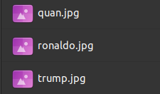

# Face Recognition Project

Setup

# 1. Install the environment
- Install Anaconda
- Run ```conda env create --file environment.yml``` in terminal
- Activate conda environment using ```conda activate face_rec```

# 2. Create database
- Create a folder called 'Database'
- Put in pictures of people you want to recognize (1 picture per person) into `/Database` directory. The image name should be <person_name>.<image_extension>, for example:

 

# 3. Configuration file for face_recognition model
- For each model, there will be a <model_name>.yaml file in ```/config```, e.g. ```/config/facerec.yaml```
- In ```facerec.yaml```, you can change a few hyperparameters for face_recognition model. Important params:
    - ```thres``` (default: 0.45) Lower threshold => harder to get a face in encoding database, but more accurate
    - ```enc_force_load```: (default: False) Whether you want to rebuild the encoding database. Must set to `True` when you run the program for the first time
    - ```frame_skip```: Number of frame to skip before making a prediction. Higher frame_skip => smoother FPS. Good when the prediction time is high
    - ```enc_list```: To add new encodings without rebuilding the database. Let's say you add 2 more images (personA.jpg and personB.jpg), then you will put ```enc_list: "personA personB"```


# 4. Acquire the JSON credentials from Google Cloud in order to use live-update Google sheet functionality
- Follow the [following tutorial](https://erikrood.com/Posts/py_gsheets.html#:~:text=Search%20for%20'Google%20Drive%20API'%2C%20enable%20it.&text=Select%20Compute%20Engine%20service%20default,it%20in%20through%20Python%20later) (the first step `(1) Google Drive API credentials` only)
- Name the JSON file `lic_face_rec.json`
- Put the JSON file under ```/credentials```, e.g. ```/credentials/lic_face_rec.json```

TODO: provide a detailed tutorial on this

# 5. Run the application (multiprocessing)
- Run ```python face_main_fast.py```

Optional arguments for ```face_main_fast.py``` include 
- `--source` (to choose webcam source, e.g. 0 for first webcam, 1 for second webcam...)

# (DEPRECIATED) Run the application (single thread)
- Run ```python face_main.py```

Optional arguments for ```face_main.py``` include 
- `--display` (to show frame or not)
- `--source` (to choose webcam source, e.g. 0 for first webcam, 1 for second webcam...)


